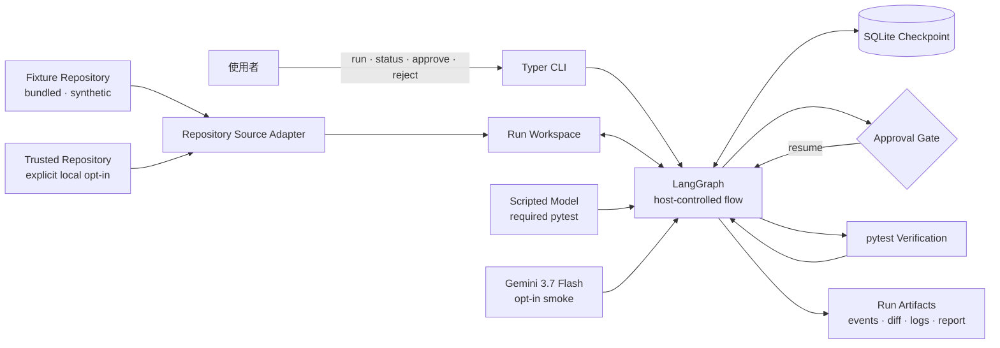

# PatchCodeAgent

以 LangGraph 實作的 test-driven coding-agent harness 練習專案。

PatchCodeAgent 的重點不是讓模型自由操作 shell，而是把一次程式修補拆成可觀察、可暫停、
可核准、可驗證的 **Patch Run**：host 控制狀態轉移與副作用，模型只負責產生 Plan、
Candidate Patch 與 Diagnosis。

> [!IMPORTANT]
> 目前程式已支援列出 bundled fixtures、建立具唯一 Run Identifier 的隔離 workspace，
> 也可用外部 Patch Run Contract 明確啟動本機 Trusted Repository，並以 SQLite 保存可跨程序
> 查詢的狀態。Baseline Verification 會在隔離 workspace 中以受限環境執行：失敗才進入
> planning；Scripted Model 只能透過 bounded list/read/search 工具觀察 workspace，產生 typed、
> checksummed Plan Artifact 與 bounded structured replacements。Host 會驗證 replacement 的
> editable path、read hash 與大小，自行產生 exact diff 和 checksummed Candidate Patch Artifact，
> 再跨程序停在 Approval Gate；此時 workspace 尚未修改。另一個 CLI process 可以取得 per-run
> exclusive lock 後核准或拒絕 Candidate。核准時會再次顯示 exact diff 與 checksum，以 replay-safe
> before/after hash 規則套用修改，執行 post-apply Verification，並在成功時保存 cumulative diff；
> Verification 失敗時會保留已核准修改、保存 typed Diagnosis，再提出相對目前 workspace 的
> 增量 Candidate，最多三次 Repair Attempts；拒絕則不修改 workspace、也不消耗 Repair Attempt。
> Host 會在 model、inspection、apply 與 Verification 邊界強制完整 Resource Budgets；每個 graph
> transition 寫入 replay-safe Run Events，所有 terminal outcomes 產生 checksummed Run Report。

完整的 MVP implementation 與 acceptance spec 見
[GitHub Issue #2](https://github.com/jerryxcy/patch-code-agent/issues/2)。

---

## 架構



| 元件 | 負責什麼 |
|---|---|
| **CLI** | 建立、查詢、核准或拒絕 Patch Run；對外只暴露 Run Identifier |
| **LangGraph** | 明確控制 phase、Resource Budget、停止條件與跨程序 resume |
| **Scripted Model** | 在 pytest 中穩定重現成功、Diagnosis、拒絕與 terminal outcomes |
| **Gemini 3.7 Flash** | 只用於 opt-in Live Smoke Run，只能接觸 bundled synthetic fixtures |
| **SQLite Checkpoint** | 保存 bounded control state，不保存大型輸出或原始碼 |
| **Repository Source Adapter** | 將 bundled fixture 或明確信任的本機 repository 正規化為同一份 Patch Run input |
| **Run Workspace** | 每個 Patch Run 的獨立副本；Repository Source 永不回寫 |
| **Run Artifacts** | 保存 Plan、Diagnosis、diff、完整 Verification logs 與 Run Report |

完整狀態機、工具與信任邊界、Approval/replay safety、Resource Budgets、artifact layout 與
Run Report schema 見 [docs/design.md](./docs/design.md)。單一決策的理由則記在
[docs/adr/](./docs/adr/0001-prioritize-engineering-demonstration.md)。

---

## 快速開始

目前需要 **Python 3.12+** 與 [uv](https://docs.astral.sh/uv/)。

```bash
uv sync --dev
uv run patch-code-agent fixtures
uv run patch-code-agent run cart-discount
uv run patch-code-agent status <run-id>
```

`run` 只接受 registry 中的 Fixture Repository ID，並將 fixture 複製到
`~/.patch-code-agent/runs/<run-id>/workspace/`。系統會先以 Patch Run Contract 的 argv 執行
Baseline Verification；`cart-discount` 的預期失敗會進入 `pending_approval`，並輸出 typed Plan、
exact Candidate Patch diff、Run Identifier、artifact checksums 與目前 counters。Candidate 只會保存為
Run Artifact，尚未套用到 workspace。使用 `approve` 可再次檢視並核准該 Candidate；互動提示預設
為 No，自動化必須明確加上 `--yes`。套用前仍會驗證 artifact checksum、workspace preimage 與
per-run lock，成功通過 Verification 後 outcome 為 `Succeeded`。Baseline 通過時結果為
`Issue Not Reproduced`，非測試失敗的
exit code 為 `Error`，60 秒逾時則為 `Budget Exceeded`。來源 fixture 永遠不會被修改。
若 post-apply Verification 以 exit code 1 失敗，系統會保存完整 log 與 bounded excerpt、建立
Diagnosis 與下一份 Candidate，重新停在 Approval Gate；第三次仍失敗則為 `Attempts Exhausted`。

指定本機 Trusted Repository 時，Patch Run Contract 必須放在 repository 外面：

```toml
source_id = "my-repository"
issue = "Fix the described defect"
verification = ["pytest"]
editable_paths = ["src/example.py"]
```

```bash
uv run patch-code-agent run-local /path/to/repository \
  --contract /path/to/patch-run.toml \
  --trust-repository
```

`--trust-repository` 表示使用者接受該 repository 的 Verification 將以 host authority 執行；
path containment 不是 hostile-code sandbox。Trusted Repository 內容不會送進 Gemini free tier。
Run storage 固定在來源樹外；任何自訂 data root 與 Repository Source 重疊時都會被拒絕。

目前可用的 CLI：

```text
patch-code-agent fixtures
patch-code-agent run cart-discount
patch-code-agent run-local <repository> --contract <contract.toml> --trust-repository
patch-code-agent status <run-id>
patch-code-agent approve <run-id>
patch-code-agent approve <run-id> --yes
patch-code-agent reject <run-id>
```

---

## 開發與測試

| 指令 | 做什麼 |
|---|---|
| `uv sync --dev` | 安裝 runtime 與 development dependencies |
| `uv run pytest` | 執行 graph 與 CLI acceptance tests |
| `uv run ruff check .` | 執行 Python lint |
| `uv run patch-code-agent run cart-discount` | 建立隔離的 CLI smoke run |
| `uv run pytest examples/tiny_repo/test_cart.py` | 執行 fixture baseline；目前預期失敗 |

---

## 專案結構

```text
src/patch_code_agent/
  __main__.py          python -m patch_code_agent 入口
  application.py       Fixture、workspace 與 checkpoint 的應用層 seam
  candidate.py         structured replacement validation、exact diff 與 replay ledger
  cli.py               Typer CLI 與 Rich 輸出
  diagnosis.py         typed Diagnosis、failure evidence 與 replay ledger
  fixtures/            Fixture manifest validation 與 registry
  graph.py             LangGraph nodes、edges 與 checkpoint 組裝
  inspection.py        bounded list、read、search 與 workspace 安全規則
  locking.py           mutating CLI commands 的 per-run exclusive lock
  patching.py          replay-safe replacement apply、preimage 分類與 cumulative diff
  planning.py          typed Plan validation、artifact checksum 與 replay ledger
  sources.py           Repository Source、Patch Run Contract 與 trusted-local validation
  state.py             Patch Run graph state
  verification.py      Baseline／Repair Verification、結果分類與 replay-safe logs
  workspace.py         隔離 Run Workspace 的建立規則

tests/
  test_cli.py          Registry、workspace、baseline outcomes、artifacts 與 durable status
  test_graph.py        Graph smoke test

examples/tiny_repo/
  fixture.toml         Fixture ID、Issue、Verification 與 editable paths
  issue.md             Cart discount Issue
  cart.py              刻意保留的錯誤實作
  test_cart.py         Fixture baseline 與 acceptance test

CONTEXT.md             PatchCodeAgent domain glossary
docs/design.md         狀態機、邊界、budgets、artifacts 與 report schema
docs/adr/              單一架構決策與取捨
docs/agents/           Engineering skills 的 repo 設定
AGENTS.md              Agent 需要讀取的 tracker 與 domain docs 入口
pyproject.toml          Package、dependencies、pytest 與 Ruff 設定
uv.lock                鎖定 dependencies
```

---

## 延伸閱讀

| 文件 | 內容 |
|---|---|
| **[GitHub Issue #2](https://github.com/jerryxcy/patch-code-agent/issues/2)** | MVP implementation 與 acceptance spec：user stories、驗收 seam、測試矩陣、完成條件與 non-goals |
| **[docs/design.md](./docs/design.md)** | 從上方架構圖逐層展開：Patch Run lifecycle、工具邊界、Approval、replay safety、artifacts 與 Run Report |
| **[CONTEXT.md](./CONTEXT.md)** | Repository Source、Patch Run、Candidate Patch、Verification 與 terminal outcomes 的正式詞彙 |
| [ADR-0001](./docs/adr/0001-prioritize-engineering-demonstration.md) | 一日 MVP 優先完成可解釋的 end-to-end engineering demonstration |
| [ADR-0002](./docs/adr/0002-make-patch-runs-resumable.md) · [ADR-0004](./docs/adr/0004-isolate-each-run-workspace.md) · [ADR-0006](./docs/adr/0006-accumulate-repair-attempts.md) | Run resume、workspace isolation 與累加 Repair Attempts |
| [ADR-0003](./docs/adr/0003-constrain-the-mvp-trust-boundary.md) · [ADR-0005](./docs/adr/0005-keep-side-effects-outside-the-model.md) · [ADR-0011](./docs/adr/0011-protect-the-verification-boundary.md) | Repository、model side effects 與 Verification 的信任邊界 |
| [ADR-0007](./docs/adr/0007-keep-orchestration-host-controlled.md) · [ADR-0013](./docs/adr/0013-use-langgraph-to-expose-the-harness.md) | Host-controlled LangGraph orchestration 與選擇較低階 abstraction 的原因 |
| [ADR-0008](./docs/adr/0008-compute-diffs-from-structured-replacements.md) · [ADR-0012](./docs/adr/0012-make-run-mutations-replay-safe.md) | Structured replacements、diff、checksum 與 replay safety |
| [ADR-0009](./docs/adr/0009-separate-control-state-from-run-artifacts.md) | SQLite control state 與 filesystem Run Artifacts 的分界 |
| [ADR-0010](./docs/adr/0010-limit-gemini-free-tier-data.md) | Gemini free tier 只能接觸 synthetic fixtures 的資料政策 |
| [docs/agents/](./docs/agents/domain.md) | GitHub Issues、triage labels 與 single-context domain docs 的 agent 設定 |
