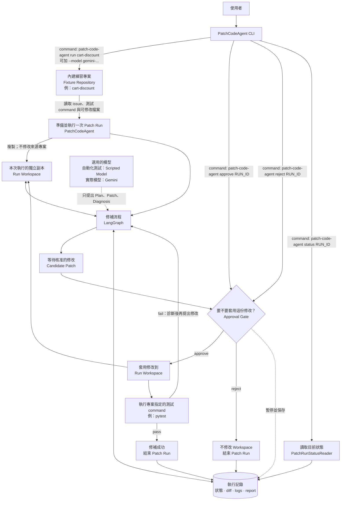

# PatchCodeAgent

這是一個用來學習 LangGraph 的 test-driven coding agent harness.。它以單一內建練習題展示 conditional routing、interrupt／resume、持久化狀態與
human-in-the-loop approval。

PatchCodeAgent 的重點不是讓模型自由操作 shell，而是把一次程式修補拆成可觀察、可暫停、
可核准、可驗證的 **Patch Run**：PatchCodeAgent 程式負責控制流程、修改檔案與執行測試，
模型只負責提出 Plan、Candidate Patch 與 Diagnosis。

---

## 架構



| 元件 | 負責什麼 |
|---|---|
| **Fixture Repository** | 專案附帶的練習題，例如 `cart-discount`；適合第一次試跑與自動化測試 |
| **Run Workspace** | 原始專案的獨立副本；所有修改都發生在這裡，不會直接改來源專案 |
| **LangGraph** | 依序執行測試、規劃、產生 Patch、等待核准、套用修改與再次測試 |
| **Scripted Model / Gemini** | 未指定 `--model` 時使用離線 Scripted Model；指定後由 Gemini 提出 Plan、Patch 與 Diagnosis |
| **執行記錄** | 保存目前狀態、diff、測試 logs 與最後的 report，供 `status` 或後續 resume 使用 |

完整狀態機、工具與信任邊界、Approval/replay safety、固定安全上限、artifact layout 與
Run Report schema 見 [docs/design.md](./docs/design.md)。

### Patch Run graph

以下 Mermaid 圖直接對應 `build_graph()` 編譯出的 nodes、edges 與 conditional routes：


修改 graph 後，執行以下 command 會在終端輸出最新的 Mermaid Markdown，可用來更新上面的圖：

```bash
uv run python scripts/render_graph.py
```

---

## 快速開始

目前需要 **Python 3.12+** 與 [uv](https://docs.astral.sh/uv/)。

### 測試內建練習專案

```bash
# 安裝專案執行與開發需要的套件。
uv sync --dev

# 列出可以直接試跑的內建練習專案。
uv run patch-code-agent fixtures

# 對 cart-discount 建立 Patch Run；記下輸出的 Run Identifier。
uv run patch-code-agent run cart-discount

# 把上一步輸出的 Run Identifier 貼到這裡。
RUN_ID="貼上 Run Identifier"

# 查看 Run 的狀態、Plan 與等待核准的 Candidate Patch。
uv run patch-code-agent status "$RUN_ID"

# 核准 Candidate Patch、套用修改並重新執行測試。
uv run patch-code-agent approve "$RUN_ID" --yes

# 查看核准後的最終狀態與測試結果。
uv run patch-code-agent status "$RUN_ID"

# 若想測試拒絕流程，先建立另一個不會影響前一個結果的 Patch Run。
uv run patch-code-agent run cart-discount

# 把新 Run 輸出的 Run Identifier 貼到這裡。
NEW_RUN_ID="貼上新的 Run Identifier"

# 拒絕 Candidate Patch。
uv run patch-code-agent reject "$NEW_RUN_ID"

# 確認該 Run 已結束且 workspace 沒有套用 Candidate Patch。
uv run patch-code-agent status "$NEW_RUN_ID"
```

核准流程完成後，看到 `Outcome: Succeeded` 和 `Verification: passed` 就代表修補成功。CLI 最後會
列出完整路徑，可依序查看修改後的檔案、Verification log、`cumulative.diff` 與 `report.json`。

### 使用 Gemini

要讓 Gemini 實際閱讀程式碼並產生 Candidate Patch，先安裝 optional dependency，再透過環境變數
提供 AI Studio key：

```bash
# 安裝 Gemini integration。
uv sync --extra gemini

# 建立本機環境變數檔案，再把 GEMINI_API_KEY 填入 .env。
cp .env.example .env

# 使用 Gemini 處理內建練習專案。
uv run patch-code-agent run cart-discount --model gemini-3.7-flash
```

Gemini 產生 Candidate Patch 後也會停在 Approval Gate；記下 Run Identifier，再接續前一節的
`status` 與 `approve` commands。

目前可用的 CLI：

```text
patch-code-agent fixtures
patch-code-agent run cart-discount [--model gemini-3.7-flash]
patch-code-agent status <run-id>
patch-code-agent approve <run-id> [--yes]
patch-code-agent reject <run-id>
```

---

## 開發與測試

| 指令 | 做什麼 |
|---|---|
| `uv sync --dev` | 安裝 runtime 與 development dependencies |
| `uv run pytest` | 執行 graph 與 CLI acceptance tests |
| `uv run ruff check .` | 執行 Python lint |
| `uv run python scripts/render_graph.py` | 從 compiled graph 輸出 Mermaid Markdown |
| `uv run patch-code-agent run cart-discount` | 建立隔離的 Patch Run |
| `uv run pytest examples/tiny_repo/test_cart.py` | 執行 fixture baseline；目前預期失敗 |

---

## 專案結構

```text
src/patch_code_agent/
  __main__.py          python -m patch_code_agent 入口
  application.py       Fixture、workspace 與 checkpoint 的應用層 seam
  candidate.py         structured replacement validation、exact diff 與 replay ledger
  cli.py               Typer CLI 與 Rich 輸出
  diagnosis.py         typed Diagnosis、failure evidence 與 replay ledger
  fixtures/            內建 Fixture Repository 的 discovery 與 registry
  gemini.py             Gemini transport、tool loop 與 retry
  graph.py             LangGraph nodes、edges 與 checkpoint 組裝
  inspection.py        bounded list、read、search 與 workspace 安全規則
  limits.py            repair、檔案、tool 與 model request 的固定安全上限
  model.py             模型輸入、輸出與離線 Scripted Model
  model_output.py      structured output validation 與修正重試
  patching.py          replay-safe replacement apply、preimage 分類與 cumulative diff
  planning.py          typed Plan validation、artifact checksum 與 replay ledger
  reporting.py         Run Events 與最終 report.json
  sources.py           Fixture 的 Patch Run Manifest、Repository Source 與 validation
  state.py             Patch Run graph state
  verification.py      Baseline／Repair Verification、結果分類與 replay-safe logs
  workspace.py         隔離 Run Workspace 的建立規則

tests/
  test_cli.py          Registry、workspace、baseline outcomes、artifacts 與 durable status
  test_gemini.py       Gemini transport contract、tool circulation、retry 與 request limit
  test_graph.py        Graph smoke test

scripts/
  render_graph.py      從 compiled graph 產生 Mermaid Markdown

examples/tiny_repo/
  patch-run.toml       內建練習題的 Issue、Verification 與 editable paths
  issue.md             Cart discount Issue
  cart.py              刻意保留的錯誤實作
  test_cart.py         Fixture baseline 與 acceptance test

CONTEXT.md             PatchCodeAgent domain glossary
docs/design.md         狀態機、邊界、安全限制、artifacts 與 report schema
docs/adr/              單一架構決策與取捨
docs/agents/           Engineering skills 的 repo 設定
AGENTS.md              Agent 需要讀取的 tracker 與 domain docs 入口
pyproject.toml          Package、dependencies、pytest 與 Ruff 設定
uv.lock                鎖定 dependencies
```

---

## 延伸閱讀

完整的 graph lifecycle、工具限制、Approval、replay safety、artifacts 與 Run Report 設計，請閱讀
[docs/design.md](./docs/design.md)。
