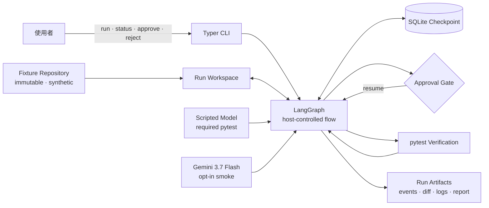

# PatchCodeAgent

以 LangGraph 實作的 test-driven coding-agent harness 練習專案。

PatchCodeAgent 的重點不是讓模型自由操作 shell，而是把一次程式修補拆成可觀察、可暫停、
可核准、可驗證的 **Patch Run**：host 控制狀態轉移與副作用，模型只負責產生 Plan、
Candidate Patch 與 Diagnosis。

> [!IMPORTANT]
> 目前程式仍是唯讀 scaffold：會驗證輸入、列出 Python 檔案並產生固定 Plan。
> 下方架構與 CLI 是已確認的 MVP 目標；尚未完成的功能不會被描述成可直接使用。

完整的 MVP implementation 與 acceptance spec 見
[GitHub Issue #2](https://github.com/jerryxcy/patch-code-agent/issues/2)。

---

## 架構



| 元件 | 負責什麼 |
|---|---|
| **CLI** | 建立、查詢、核准或拒絕 Patch Run；對外只暴露 Run Identifier |
| **LangGraph** | 明確控制 phase、Resource Budget、停止條件與跨程序 resume |
| **Scripted Model** | 在 pytest 中穩定重現成功、Diagnosis、拒絕與 terminal outcomes |
| **Gemini 3.7 Flash** | 只用於 opt-in Live Smoke Run，只能接觸 bundled synthetic fixtures |
| **SQLite Checkpoint** | 保存 bounded control state，不保存大型輸出或原始碼 |
| **Run Workspace** | 每個 Patch Run 的獨立副本；Fixture Repository 永不回寫 |
| **Run Artifacts** | 保存 Plan、Diagnosis、diff、完整 Verification logs 與 Run Report |

完整狀態機、工具與信任邊界、Approval/replay safety、Resource Budgets、artifact layout 與
Run Report schema 見 [docs/design.md](./docs/design.md)。單一決策的理由則記在
[docs/adr/](./docs/adr/0001-prioritize-engineering-demonstration.md)。

---

## 快速開始

目前需要 **Python 3.12+** 與 [uv](https://docs.astral.sh/uv/)。

```bash
uv sync --dev
uv run patch-code-agent run "Fix the failing cart discount tests" --repo examples/tiny_repo
```

目前 CLI 只會輸出 starter Plan、Run Identifier、掃描到的 Python 檔案數與 `planned` status；
不會修改 cart fixture，也不會執行它的 failing test。

目標 MVP CLI：

```text
patch-code-agent fixtures
patch-code-agent run cart-discount
patch-code-agent status <run-id>
patch-code-agent approve <run-id>
patch-code-agent approve <run-id> --yes
patch-code-agent reject <run-id>
```

---

## 開發與測試

| 指令 | 做什麼 |
|---|---|
| `uv sync --dev` | 安裝 runtime 與 development dependencies |
| `uv run pytest` | 執行目前的 graph smoke test |
| `uv run ruff check .` | 執行 Python lint |
| `uv run patch-code-agent run "Fix the cart" --repo examples/tiny_repo` | 執行目前的 CLI smoke check |
| `uv run pytest examples/tiny_repo/test_cart.py` | 執行 fixture baseline；目前預期失敗 |

---

## 專案結構

```text
src/patch_code_agent/
  __main__.py          python -m patch_code_agent 入口
  cli.py               Typer CLI 與 Rich 輸出
  graph.py             LangGraph nodes、edges 與 checkpoint 組裝
  state.py             Patch Run graph state

tests/
  test_graph.py        目前的 graph smoke test

examples/tiny_repo/
  issue.md             Cart discount Issue
  cart.py              刻意保留的錯誤實作
  test_cart.py         Fixture baseline 與 acceptance test

CONTEXT.md             PatchCodeAgent domain glossary
docs/design.md         狀態機、邊界、budgets、artifacts 與 report schema
docs/adr/              單一架構決策與取捨
docs/agents/           Engineering skills 的 repo 設定
AGENTS.md              Agent 需要讀取的 tracker 與 domain docs 入口
pyproject.toml          Package、dependencies、pytest 與 Ruff 設定
uv.lock                鎖定 dependencies
```

---

## 延伸閱讀

| 文件 | 內容 |
|---|---|
| **[GitHub Issue #2](https://github.com/jerryxcy/patch-code-agent/issues/2)** | MVP implementation 與 acceptance spec：user stories、驗收 seam、測試矩陣、完成條件與 non-goals |
| **[docs/design.md](./docs/design.md)** | 從上方架構圖逐層展開：Patch Run lifecycle、工具邊界、Approval、replay safety、artifacts 與 Run Report |
| **[CONTEXT.md](./CONTEXT.md)** | Patch Run、Fixture Repository、Candidate Patch、Verification 與 terminal outcomes 的正式詞彙 |
| [ADR-0001](./docs/adr/0001-prioritize-engineering-demonstration.md) | 一日 MVP 優先完成可解釋的 end-to-end engineering demonstration |
| [ADR-0002](./docs/adr/0002-make-patch-runs-resumable.md) · [ADR-0004](./docs/adr/0004-isolate-each-run-workspace.md) · [ADR-0006](./docs/adr/0006-accumulate-repair-attempts.md) | Run resume、workspace isolation 與累加 Repair Attempts |
| [ADR-0003](./docs/adr/0003-constrain-the-mvp-trust-boundary.md) · [ADR-0005](./docs/adr/0005-keep-side-effects-outside-the-model.md) · [ADR-0011](./docs/adr/0011-protect-the-verification-boundary.md) | Repository、model side effects 與 Verification 的信任邊界 |
| [ADR-0007](./docs/adr/0007-keep-orchestration-host-controlled.md) · [ADR-0013](./docs/adr/0013-use-langgraph-to-expose-the-harness.md) | Host-controlled LangGraph orchestration 與選擇較低階 abstraction 的原因 |
| [ADR-0008](./docs/adr/0008-compute-diffs-from-structured-replacements.md) · [ADR-0012](./docs/adr/0012-make-run-mutations-replay-safe.md) | Structured replacements、diff、checksum 與 replay safety |
| [ADR-0009](./docs/adr/0009-separate-control-state-from-run-artifacts.md) | SQLite control state 與 filesystem Run Artifacts 的分界 |
| [ADR-0010](./docs/adr/0010-limit-gemini-free-tier-data.md) | Gemini free tier 只能接觸 synthetic fixtures 的資料政策 |
| [docs/agents/](./docs/agents/domain.md) | GitHub Issues、triage labels 與 single-context domain docs 的 agent 設定 |
