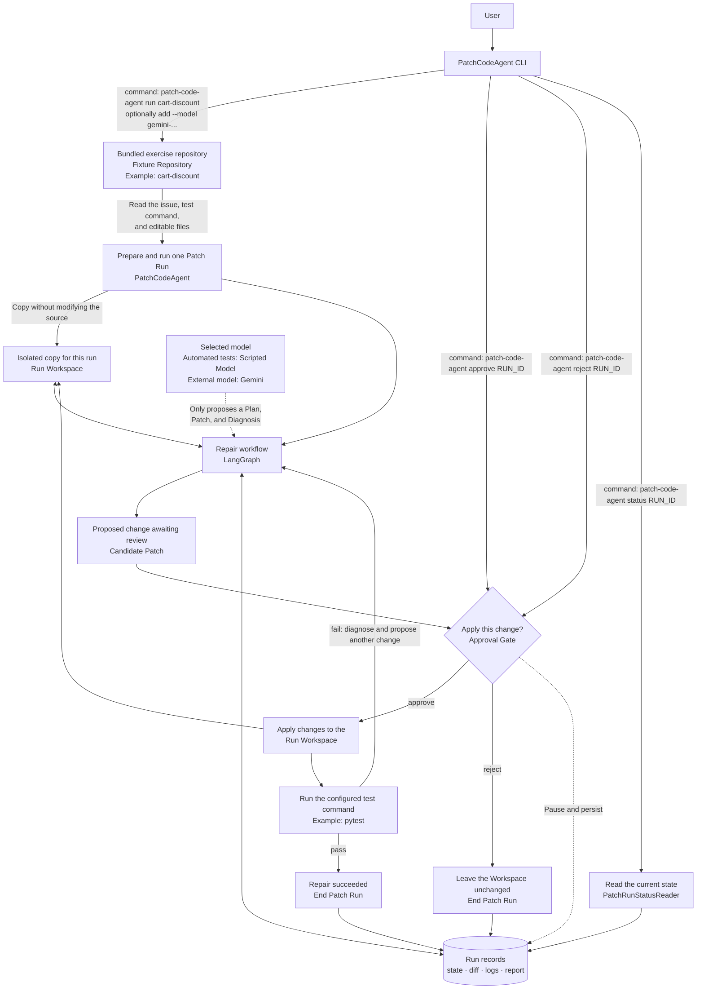
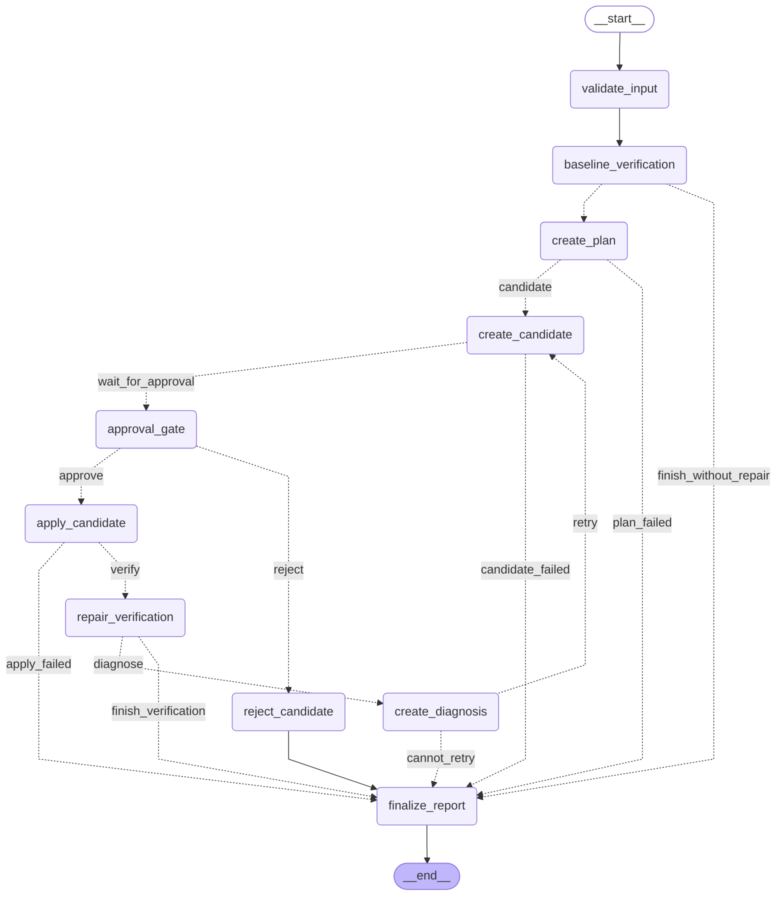

# PatchCodeAgent

English | [繁體中文](./README.zh-TW.md)

This is a test-driven coding agent harness for learning LangGraph. It uses one bundled exercise to
demonstrate conditional routing, interrupt/resume, persistent state, and human-in-the-loop
approval.

Instead of giving a model unrestricted shell access, PatchCodeAgent breaks a code repair into an
observable, pausable, reviewable, and verifiable **Patch Run**. PatchCodeAgent controls the flow,
modifies files, and runs tests; the model only proposes a Plan, Candidate Patch, and Diagnosis.

---

## Architecture



| Module | Responsibility |
|---|---|
| **Fixture Repository** | A bundled exercise such as `cart-discount`; useful for a first run and automated tests |
| **Run Workspace** | An isolated copy of the source; all changes happen here, never in the source fixture |
| **LangGraph** | Runs verification, planning, patch generation, approval, patch application, and verification again |
| **Scripted Model / Gemini** | Uses the offline Scripted Model unless `--model` selects Gemini to propose a Plan, Patch, and Diagnosis |
| **Run records** | Persist state, diffs, test logs, and the final report for `status` and later resume operations |

See [docs/design.md](./docs/design.md) for the full state machine, tool and trust boundaries,
Approval and replay safety, fixed safety limits, artifact layout, and Run Report schema.

### Patch Run graph

The Mermaid graph below directly reflects the nodes, edges, and conditional routes compiled by
`build_graph()`:



After changing the graph, run this command to print the latest Mermaid Markdown for updating the
diagram above:

```bash
uv run python scripts/render_graph.py
```

---

## Quick start

PatchCodeAgent requires **Python 3.12+** and [uv](https://docs.astral.sh/uv/).

### Try the bundled exercise

```bash
# Install runtime and development dependencies.
uv sync --dev

# List the bundled exercises that are ready to run.
uv run patch-code-agent fixtures

# Start a Patch Run for cart-discount and note the printed Run Identifier.
uv run patch-code-agent run cart-discount

# Paste the Run Identifier from the previous command here.
RUN_ID="paste the Run Identifier here"

# Inspect the Run state, Plan, and Candidate Patch awaiting approval.
uv run patch-code-agent status "$RUN_ID"

# Approve the Candidate Patch, apply it, and rerun the tests.
uv run patch-code-agent approve "$RUN_ID" --yes

# Inspect the final state and test result.
uv run patch-code-agent status "$RUN_ID"

# To try rejection, start a separate Patch Run that will not affect the previous result.
uv run patch-code-agent run cart-discount

# Paste the new Run Identifier here.
NEW_RUN_ID="paste the new Run Identifier here"

# Reject the Candidate Patch.
uv run patch-code-agent reject "$NEW_RUN_ID"

# Confirm that the Run ended without applying the Candidate Patch to its workspace.
uv run patch-code-agent status "$NEW_RUN_ID"
```

When the approval flow finishes, `Outcome: Succeeded` and `Verification: passed` mean the repair
succeeded. The CLI prints full paths to the modified files, Verification log, `cumulative.diff`,
and `report.json` so you can inspect the result.

### Use Gemini

To let Gemini read the code and propose a Candidate Patch, install the optional dependency and
provide a Google AI Studio key through an environment variable:

```bash
# Install the Gemini integration.
uv sync --extra gemini

# Create a local environment file, then add your GEMINI_API_KEY to .env.
cp .env.example .env

# Use Gemini for the bundled exercise.
uv run patch-code-agent run cart-discount --model gemini-3.7-flash
```

The graph still pauses at the Approval Gate after Gemini produces a Candidate Patch. Note the Run
Identifier, then continue with the `status` and `approve` commands from the previous section.

Available CLI commands:

```text
patch-code-agent fixtures
patch-code-agent run cart-discount [--model gemini-3.7-flash]
patch-code-agent status <run-id>
patch-code-agent approve <run-id> [--yes]
patch-code-agent reject <run-id>
```

---

## Development and testing

| Command | Purpose |
|---|---|
| `uv sync --dev` | Install runtime and development dependencies |
| `uv run pytest` | Run the graph and CLI acceptance tests |
| `uv run ruff check .` | Run the Python linter |
| `uv run python scripts/render_graph.py` | Print Mermaid Markdown from the compiled graph |
| `uv run patch-code-agent run cart-discount` | Create an isolated Patch Run |
| `uv run pytest examples/tiny_repo/test_cart.py` | Run the fixture baseline; it is expected to fail |

---

## Project structure

```text
src/patch_code_agent/
  __main__.py          Entry point for python -m patch_code_agent
  application.py       Application seam for fixtures, workspaces, and checkpoints
  candidate.py         Structured replacement validation, exact diffs, and replay ledger
  cli.py               Typer CLI and Rich output
  diagnosis.py         Typed Diagnosis, failure evidence, and replay ledger
  fixtures/            Discovery and registry for bundled Fixture Repositories
  gemini.py             Gemini transport, tool loop, and retries
  graph.py              LangGraph nodes, edges, and checkpoint assembly
  inspection.py         Bounded list, read, and search tools plus workspace safety rules
  limits.py             Fixed safety limits for repairs, files, tools, and model requests
  model.py              Model inputs, outputs, and the offline Scripted Model
  model_output.py       Structured output validation and correction retry
  patching.py           Replay-safe replacement apply, preimage classification, and cumulative diff
  planning.py           Typed Plan validation, artifact checksum, and replay ledger
  reporting.py          Run Events and the final report.json
  sources.py            Fixture Patch Run Manifest, Repository Source, and validation
  state.py              Patch Run graph state
  verification.py      Baseline/Repair Verification, outcome classification, and replay-safe logs
  workspace.py         Rules for creating isolated Run Workspaces

tests/
  test_cli.py          Registry, workspace, baseline outcomes, artifacts, and durable status
  test_gemini.py       Gemini transport contract, tool circulation, retries, and request limit
  test_graph.py        Graph smoke test

scripts/
  render_graph.py      Generate Mermaid Markdown from the compiled graph

examples/tiny_repo/
  patch-run.toml       Issue, Verification command, and editable paths for the bundled exercise
  issue.md             Cart discount Issue
  cart.py              Deliberately incorrect implementation
  test_cart.py         Fixture baseline and acceptance test

CONTEXT.md             PatchCodeAgent domain glossary
docs/design.md         State machine, boundaries, safety limits, artifacts, and report schema
docs/adr/              Individual architectural decisions and tradeoffs
docs/agents/           Repository configuration for engineering skills
AGENTS.md              Entry point for tracker and domain documentation used by agents
pyproject.toml          Package, dependency, pytest, and Ruff configuration
uv.lock                Locked dependencies
```

---

## Further reading

For the complete graph lifecycle, tool limits, Approval flow, replay safety, artifacts, and Run
Report design, see [docs/design.md](./docs/design.md).
