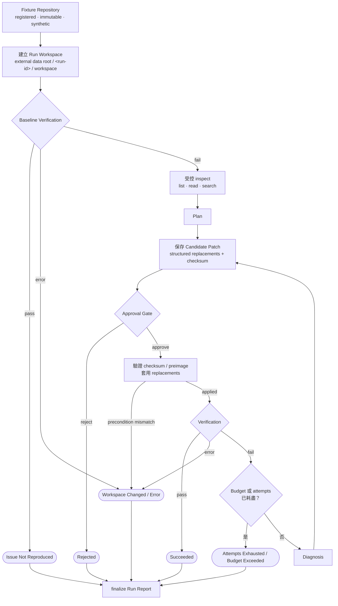
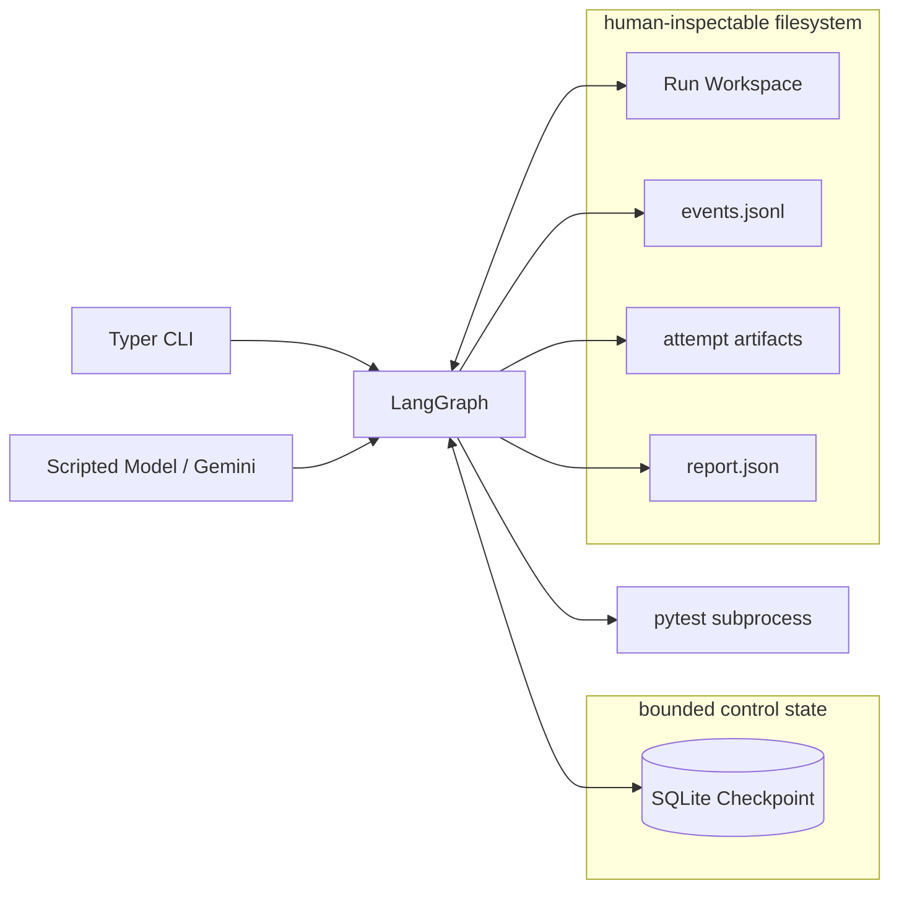

# 設計

從 [README 的架構圖](../README.md#架構)逐層往下展開。正式詞彙見
[CONTEXT.md](../CONTEXT.md)；單一決策的背景與取捨見 [ADR](./adr/)；完整 MVP
implementation 與 acceptance spec 見
[GitHub Issue #2](https://github.com/jerryxcy/patch-code-agent/issues/2)。

這份文件描述目前的 MVP 設計；驗收進度以 GitHub Issue #2 為準。

---

## 一、Patch Run lifecycle

Patch Run 可以使用內建 Fixture，或使用者明確信任的本機 Repository。兩者進入 graph 後都走
相同流程；來源 Repository 不會被直接修改。



Graph flow：

1. **建立隔離 workspace。** 把 Repository Source 複製到這次 Run 專用的目錄。
2. **驗證輸入。** 確認 workspace、Issue 與 Patch Run Contract 可以使用。
3. **執行 Baseline Verification。** 若已通過，代表問題無法重現；若測試失敗，才請模型規劃修補。
4. **建立 Plan。** 模型透過受限的 list、read、search 工具了解程式碼並提出計畫。
5. **建立 Candidate Patch。** 模型提出檔案替換內容，host 驗證後產生並保存 exact diff。
6. **等待 Approval。** Graph 暫停讓使用者核准或拒絕，此時 workspace 還沒有被修改。
7. **套用已核准的 Candidate。** Host 再次核對 checksum 與檔案版本，確認一致才寫入 workspace。
8. **再次執行 Verification。** 通過就完成；執行錯誤或超時就以對應狀態結束。
9. **診斷失敗並重試。** 測試仍失敗時保存 Diagnosis，再建立下一份增量 Candidate，最多三次。
10. **產生 Run Report。** 所有結束路徑都保存最終狀態與可追蹤的 artifacts。

順序有三個不能交換的 invariant：

1. **先跑 baseline，再呼叫模型。** Baseline 通過代表 Repository Source 未能重現 Issue，
   Patch Run 直接成為 Issue Not Reproduced。
2. **先保存 Candidate Patch，再暫停。** Approval Gate 顯示的 diff 與 checksum 必須是
   immutable Run Artifact，resume 時才能證明核准的仍是同一份內容。
3. **先核准，再寫入。** 模型永遠沒有直接寫入能力；host 驗證所有 preconditions 後才套用
   replacements，然後由 Verification 判定結果。

每個 Patch Run 只有一份 Plan。Verification 失敗後保留已核准的修改，產生 Diagnosis，下一份
Candidate Patch 是相對目前 Run Workspace 的增量修改。最多三次 Repair Attempts。

---

## 二、控制狀態與 Run Artifacts



Checkpoint 只保存恢復 graph 所需的小型、JSON-serializable control state：phase、status、
attempt、Resource Budget counters、artifact IDs / paths / checksums、Approval result 與 bounded
Verification summary。不能放 model client、open file、subprocess handle、大型 source content 或
完整 stdout / stderr。

Filesystem layout：

```text
~/.patch-code-agent/runs/  # default data root; must not overlap Repository Source
  checkpoints.sqlite
  <run-id>/
    workspace/
    events.jsonl
    plan.json
    baseline/
      result.json
      output.log
    attempts/
      1/
        preimages.json
        candidate.json
        candidate.diff
        verification.json
        verification.log
        diagnosis.json
    cumulative.diff
    report.json
```

Run Event 使用 stable event ID，append 前先確認尚未存在。LangGraph replay 不能重複 event、
灌大 counters 或重做外部副作用。

---

## 三、Model 與工具邊界

模型只能透過 bounded tools 觀察 Run Workspace：

| Tool | 能做什麼 | 不能做什麼 |
|---|---|---|
| `list_files` | 列出允許範圍內的文字檔 | 進入 hidden / ignored directories |
| `read_file` | 讀取 100 KiB 以下、非 symlink、一般 UTF-8 文字檔 | 讀 workspace 外路徑或 binary |
| `search_code` | 搜尋允許檔案，單次最多回 32 KiB | 執行 shell 或未受限 regex process |
| structured output | 回傳 Plan、Diagnosis、file replacements | 直接寫檔或執行 Verification |

每一層 path 都拒絕 symlink；resolved path 必須仍位於 Run Workspace。掃描排除 `.git`、
virtualenv、cache、build output 與 hidden directories。

Candidate Patch 只能替換 Patch Run Contract `editable_paths` 中已存在、已由模型讀過的檔案。
每個 replacement 包含 `path + expected_sha256 + new_content`；MVP 不支援 create、delete、rename
或 binary changes。Host 驗證 replacements 後，自己計算供 Approval Gate 顯示的 unified diff。

Fixture 與 Trusted Repository 都可以使用 Gemini，但必須由使用者在 command 明確指定
`--model`。這代表同意把 Gemini 透過 bounded tools 讀取的檔案內容與搜尋結果送到 Gemini
Developer API；`--trust-repository` 只代表允許本機 Verification execution，兩種同意不能互相
取代。Credentials、個資與其他不可外傳內容仍不得進入 request。Required pytest 使用 Scripted
Model，不依賴 provider availability。

CLI 會從目前目錄的 `.env` 載入 `GEMINI_API_KEY`，shell 中的同名環境變數優先。Key 只會傳入
Gemini client，不會寫入 SQLite Checkpoint、Run Events、Run Artifacts、Run Report 或
Verification environment。每個 provider request（包含 retry）的 credential-free transcript
會保存在 `model-transcripts/*.jsonl`；Run Report 則記錄實際使用的 model ID。

---

## 四、Approval 與 replay safety

`run` 保存 Candidate Patch 後，以 LangGraph interrupt 暫停並退出 process。之後的
`approve <run-id>` 或 `reject <run-id>` 重新開啟相同 SQLite Checkpoint，使用相同 Run
Identifier resume。

`approve` 必須重新顯示 immutable diff 與 checksum，並以 **No** 為預設。自動化只能顯式傳
`--yes`；這個 flag 只略過互動 prompt，不略過 candidate checksum、file preimage hashes、
Run Workspace 狀態或 per-run lock。

CLI 會從 Run state 恢復原本的 model ID，不要求使用者在 `approve` 重複指定。若 Verification
通過，resume 不會建立外部 model client；只有失敗後進入 Diagnosis 時才載入 Gemini credential
並繼續使用同一個 model。

Apply node 以所有 replacements 的 before / after hashes 保持可重入：

| 觀察結果 | 行為 |
|---|---|
| 全部符合 before hashes | 可以安全套用 |
| 全部符合 after hashes | 前次執行已完成，直接進 Verification |
| 任一檔案兩者皆不符 | Workspace Changed |
| 一部分 before、一部分 after | Error，`error_kind: partial_apply` |

一般寫入錯誤會嘗試以 preimage rollback；process crash 造成 mixed state 時不猜測如何繼續。
同一 Patch Run 的 mutating CLI commands 使用 exclusive lock，第二個 command 回報 busy；
`status` 保持唯讀。

---

## 五、Resource Budgets 與 failure semantics

| 項目 | 上限 |
|---|---:|
| Repair Attempts | 3 |
| 不同檔案讀取數 | 12 |
| 修改檔案數 | 3 |
| Tool executions | 20 |
| Model requests | 8，包含 provider retries |
| 單次 Verification | 60 秒 |
| Active Patch Run time | 5 分鐘，不含 Approval Gate 等待時間 |

等待人工核准不計入 active time；model retry / backoff、tool execution 與 Verification 都計入。
Gemini transient request 最多 retry 兩次，每次仍消耗 model request budget。Typed model output
不符合 Pydantic schema 時，使用 validation errors 修正一次；仍失敗則 Error，
`error_kind: invalid_model_output`，但不消耗 Repair Attempt。

pytest exit code 的分類：

| Exit code | Baseline | Repair Attempt |
|---:|---|---|
| `0` | Issue Not Reproduced | Succeeded |
| `1` | 正常的 failing baseline | 可診斷的 Verification failure |
| `2`–`5` | Verification Error | Verification Error |
| timeout | Budget Exceeded | Budget Exceeded |

完整 stdout / stderr 永遠寫入 Run Artifact；模型與 Checkpoint 最多只收到 32 KiB failure
excerpt。一般 Gemini Patch Run 遇到 quota、429 或 provider unavailable 時會保存 Error outcome；
`live-smoke` 則回報 inconclusive。兩者都不會讓 required pytest 失敗。

---

## 六、Outcomes 與 Run Report

每個 terminal outcome 都執行 `finalize_report`：Succeeded、Rejected、Issue Not Reproduced、
Attempts Exhausted、Budget Exceeded、Workspace Changed 或 Error。Rejected Candidate Patch
不算 Repair Attempt。

Target Run Report：

```json
{
  "schema_version": "1",
  "run_id": "<run-id>",
  "source_kind": "fixture",
  "source_id": "cart-discount",
  "source_revision": "<source-revision>",
  "model_id": "gemini-3.7-flash",
  "outcome": "succeeded",
  "terminal_reason": null,
  "error_kind": null,
  "started_at": "2026-08-30T06:00:00Z",
  "finished_at": "2026-08-30T06:00:43Z",
  "active_duration_seconds": 43.2,
  "attempts": 2,
  "model_requests": 6,
  "tool_executions": 11,
  "files_read": ["cart.py", "test_cart.py"],
  "files_changed": ["cart.py"],
  "verification": {
    "baseline": {"outcome": "failed", "exit_code": 1, "artifact": "baseline/output.log"},
    "attempts": [
      {"attempt": 1, "outcome": "failed", "artifact": "attempts/1/verification.log"},
      {"attempt": 2, "outcome": "passed", "artifact": "attempts/2/verification.log"}
    ]
  },
  "artifacts": {
    "plan": {"path": "plan.json", "sha256": "<sha256>"},
    "diagnoses": [{"path": "attempts/1/diagnosis.json", "sha256": "<sha256>"}],
    "candidates": [
      {"path": "attempts/1/candidate.json", "sha256": "<sha256>"},
      {"path": "attempts/2/candidate.json", "sha256": "<sha256>"}
    ],
    "cumulative_diff": {"path": "cumulative.diff", "sha256": "<sha256>"}
  },
  "budgets": {
    "repair_attempts": {"limit": 3, "used": 2},
    "model_requests": {"limit": 8, "used": 6},
    "tool_executions": {"limit": 20, "used": 11},
    "files_read": {"limit": 12, "used": 2},
    "files_changed": {"limit": 3, "used": 1},
    "verification_seconds": {"limit": 60, "used_max": 0.9},
    "active_seconds": {"limit": 300, "used": 43.2}
  }
}
```

---

## 七、MVP 之外

- Naive-agent versus harness comparison
- Untrusted repositories 或 implicit repository discovery
- Hostile-code execution sandbox
- Git branch / commit integration
- Provider-agnostic model support
- Automatic Run Workspace retention / cleanup

這些不是「永遠不做」，只是不能稀釋一日 MVP 要展示的 Approval、persistence、Verification、
replay safety 與可稽核性。
